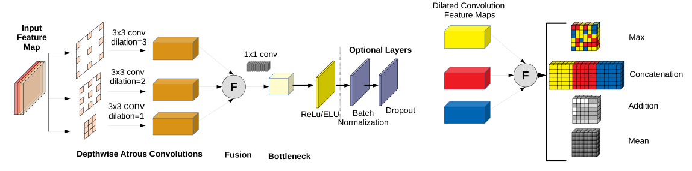
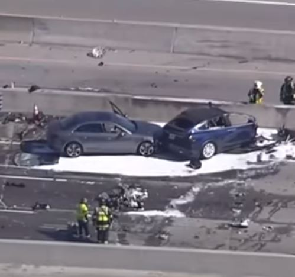
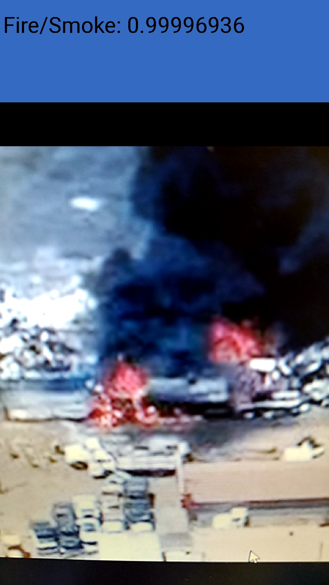

<a href="https://www.christoskyrkou.com/">

</a>

# EmergencyNet

## Overview
There is a need to design specialized networks that are inherently computationally efficient to enable there use in resource contraint devices such as UAVs. The design space can be explored by focusing on the layer configurations, type and connectivity. An architecture is poropsed that allows for flexible aggregation of the multi-scale contextual information while keeping the same resolution and reduced number of parameters. It is based on the Atrous Convolutional Feature Fusion (ACFF) block. computes multiple such atrous convolutional
features for the same input map across different dilation rates. Each atrous convolution is factored into depth-wise convolution that performs lightweight filtering by applying a single convolutional kernel per input channel to reduce the computational complexity. An essential part of optimized CNNs is reducing not only the spatial size of feature maps but also the channel dimensions. Hence, prior to the atrous convolutions the input feature map channels are halved. This makes it possible to have multiple branches for atrous convolution without significantly impacting the performance. The depth reduction factor is a hyperparameter that can be further tuned depending on the requirements. The atrous convolutional features at different dilation rates need to be combined together to allow the unit to learn from representations from a large effective receptive field. The fusion mechanism is then followed by 1x1 convolutions and activation that non-linearly combine channel features together and projects them into a higher dimensional space.

The ACFF macro block is used as a starting point to build a deep neural network that is characterized by lowcomputational complexity and is suitable for embedded platforms. 
- Reduced Cost of First Layer: The first layer typically incurs the higher computational cost since it is applied across the whole image. Hence, a relatively small number of filters is selected (16)
- Early downsampling: Downsampling is performed at all the initial layers. A combination of stride and maxpooling layers are used in an effort to reduce the loss of information by aggressive striding
- Regularization: Due to the relatively small size of the dataset compared to databases such as ImageNet; additional regularization techniques are also incorporated



## Code
A minimal code for training and ACFF network is provided within the *code* folder with additional supporting code.
  - Model definition is in model.py.  
  - Change the definition of a network within the model.py file.
  - Run train_ACFFNet.py to train a network.
  - Run test_ACFFNet.py the model on a validation generator. You can build on this inference pipeline for your custom testing purposes.

Download and place your dataset and put it in the *data* folder. Put all images for each class in one folder. Training and Validation splits are handled through a keras generator. If you have already split the two then you need to change to write custom generators.
  
  ```
./
└───data
│   │
│   └───AIDER
│       │   └───collapsed_building
│   │   │    |    collapsed_building (1).jpg
│   │   │    |    collapsed_building (2).jpg
.
.
│       │   └───fire
│   │   │    |    fire (1).jpg
│   │   │    |    fire (2).jpg
.
.
│       │   └───flooded_areas
│   │   │    |    flooded_areas (1).jpg
│   │   │    |    flooded_areas (2).jpg
.
.
│       │   └───normal
│   │   │    |    normal (1).jpg
│   │   │    |    normal (2).jpg
.
.
│       │   └───traffic_incident
│   │   │    |    traffic_incident (1).jpg
│   │   │    |    traffic_incident (2).jpg
```

Outputs are the full model file, model weights, accuracy and loss curves. These are stored within the *results* folder.

## Models
Three models are provided:
- EmegencyNet: The ACFF based convolutional neural network ([model📜 ](https://drive.google.com/file/d/1qHbBLiIi0lXzlOhwegiJSvMGz3nkuthl/view?usp=sharing))
- MobileNetV3: A convolutional neural network finetuned from the [MobileNetV3](https://arxiv.org/abs/1905.02244) architecture ([model📜 ](https://drive.google.com/file/d/1qkvUu5ATaP-KIuG5iA6keKaLg7Z_DF09/view?usp=sharing)) | Use the MobileNetV3 functions from this [repo](https://github.com/xiaochus/MobileNetV3)
- EfficientNet B0: A convolutional neural network finetuned from the [EfficientNet B0](https://arxiv.org/abs/1905.11946) architecture ([model📜 ](https://drive.google.com/file/d/1CfRuLQ3MGoPu1eVVtXvXs14MF9mhE-yH/view?usp=sharing)) | You will need to install efficientnet for keras through this [repo](https://github.com/qubvel/efficientnet)

-- Load the models using the *load_model* function of keras and read the images with opencv's *imread* function (BGR format).
-- Normalize the images using the formula: *x = (x / 127.5) - 1*

Use the following information to decode the model outputs:
| Class | Network Output Value |
| ------------- | ------------- |
| collapsed_building | 0 |
| Fire | 1  |
| Flood | 2  |
| Normal/None | 3  |
| Traffic Incident | 4  |

## Prerequisites
These models where trained using Keras v2.2 and TF v1.8.0. However, the training pipeline is updated to TF v2. See requirements.txt for more details.

## Example Outputs
The network can correctly classify some indicative examples from real world events such as
- The Tesla Model X crash into a roadside barrier (2018) -> *traffic_incident* with probability 0.78


- The Hawaii Volcano Eruption (2018) -> *fire* with probability 0.9116652


The network can also be ported on andoid and itegraded with UAV applications to process the video feed locally.



## Citation Information
Please cite the following paper if you find this is useful for your work: 

- C. Kyrkou and T. Theocharides, "EmergencyNet: Efficient Aerial Image Classification for Drone-Based Emergency Monitoring Using Atrous Convolutional Feature Fusion," in IEEE Journal of Selected Topics in Applied Earth Observations and Remote Sensing, vol. 13, pp. 1687-1699, 2020.[paper📜 ](https://ieeexplore.ieee.org/abstract/document/9050881)

For more please visit: https://www.christoskyrkou.com
